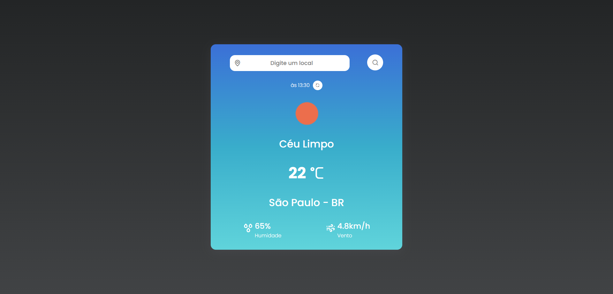

<a id="readme-top"></a>


# Clima Atual



> Selecione locais ao redor do mundo e veja as informações atuais sobre o clima

<a href="https://rafael-weather.netlify.app/">Ver projeto</a>


<!-- SUMÁRIO -->
<details>
  <summary>Sumário</summary>
  <ol>
    <li><a href="#ajustes-e-melhorias">Ajustes e melhorias</a></li>
    <li><a href="#tecnologias">Tecnologias</a></li>
    <li><a href="#pré-requisitos">Pré-requisitos</a></li>
    <li><a href="#instalação">Instalação</a></li>
    <li><a href="#uso">Uso</a></li>
    <li><a href="#contato">Contato</a></li>
    <li><a href="#agradecimentos">Agradecimentos</a></li>
  </ol>
</details>


<!-- AJUSTES E MELHORIAS -->
## Ajustes e melhorias

O projeto ainda está em desenvolvimento e as próximas atualizações serão voltadas nas seguintes tarefas:

- [ ] Adicionar a hora em que o clima foi calculado
- [ ] Adicionar botão para atualziar o clima do local selecionado
- [ ] Adicionar descrição do clima atual
- [ ] Melhorar os ícones exibidos
- [ ] Melhorar o background exibido

<p align="right">(<a href="#readme-top">back to top</a>)</p>


<!-- TECNOLOGIAS -->
## Tecnologias

* ![HTML][HTML]
* ![CSS][CSS]
* ![JavaScript][JavaScript]
* [![Axios][Axios-badge]][Axios-url]

<p align="right">(<a href="#readme-top">back to top</a>)</p>


<!-- PRÉ-REQUISITOS -->
## Pré-requisitos

Algum servidor web instalado e ativo para rodar o projeto como:

* Apache
* nginx
* Live Server (VSCode)


<!-- INSTALAÇÃO -->
## Instalação

Clone o repositório
   ```sh
   git clone https://github.com/rafaelcfdantas/weather_app.git
   ```

<p align="right">(<a href="#readme-top">back to top</a>)</p>


<!-- USO -->
## Uso

Para usar o app, basta digitar o nome de algum lugar do mundo que será exibido a temperatura atual


<p align="right">(<a href="#readme-top">back to top</a>)</p>


<!-- CONTATO -->
## Contato

[![GitHub][GitHub-badge]][GitHub-url]
[![LinkedIn][LinkedIn-badge]][LinkedIn-url]
[![Gmail][Gmail-badge]][Gmail-url]

<p align="right">(<a href="#readme-top">back to top</a>)</p>


<!-- MARKDOWN LINKS & IMAGES -->

<!-- Social -->
[GitHub-badge]: https://img.shields.io/badge/GitHub-100000?style=for-the-badge&logo=github&logoColor=white
[GitHub-url]: https://github.com/rafaelcfdantas/
[LinkedIn-badge]: https://img.shields.io/badge/LinkedIn-0077B5?style=for-the-badge&logo=linkedin&logoColor=white
[LinkedIn-url]: https://www.linkedin.com/in/rafael-dantas-2019/
[Gmail-badge]: https://img.shields.io/badge/Gmail-D14836?style=for-the-badge&logo=gmail&logoColor=white
[Gmail-url]: mailto:rafael.cfd1999@gmail.com

<!-- Tecnologias -->
[HTML]: https://img.shields.io/badge/html-white.svg?style=for-the-badge&logo=html5&logoColor=E34F26
[CSS]: https://img.shields.io/badge/CSS-white?&style=for-the-badge&logo=css3&logoColor=blue
[JavaScript]: https://img.shields.io/badge/JavaScript-323330?style=for-the-badge&logo=javascript&logoColor=F7DF1E
[Axios-badge]: https://img.shields.io/badge/Axios-ffffff?style=for-the-badge&logo=axios&logoColor=5A29E4
[Axios-url]: https://axios-http.com/